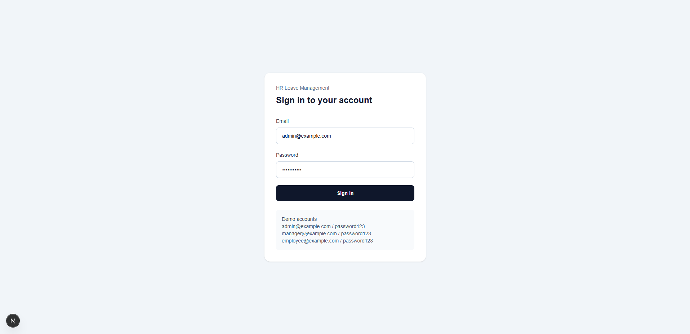
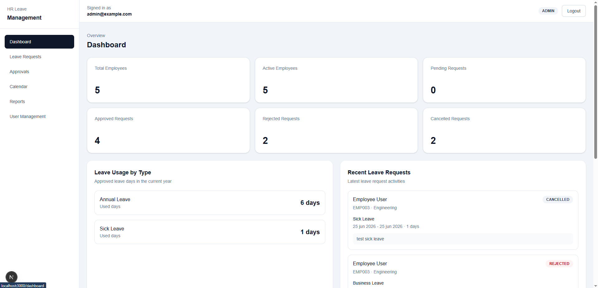
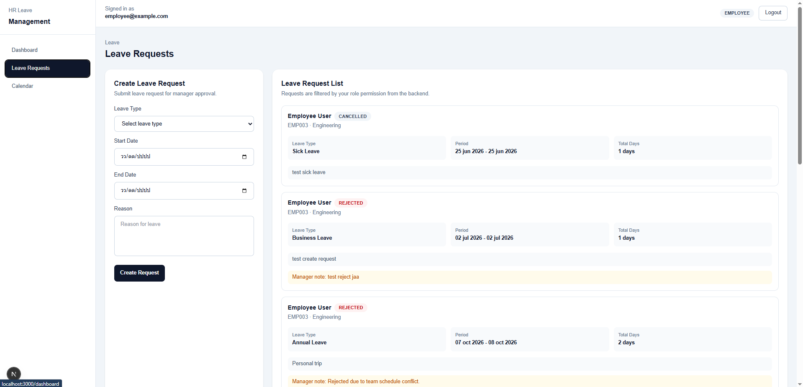
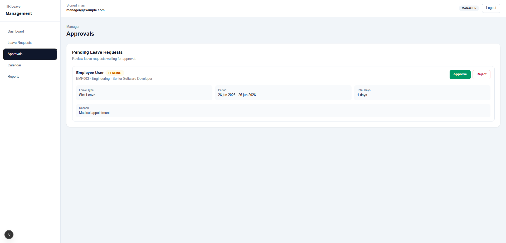
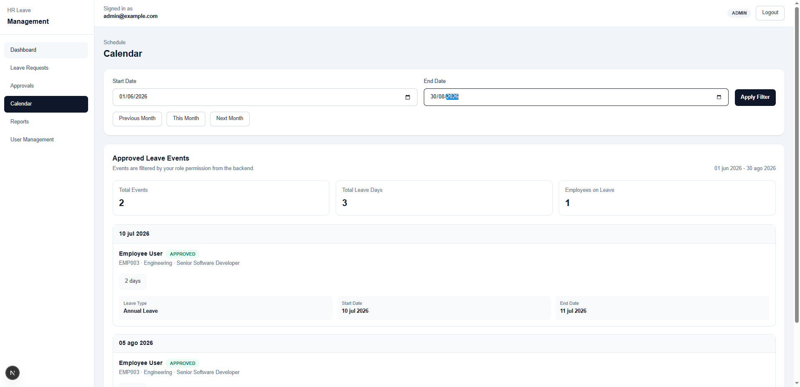
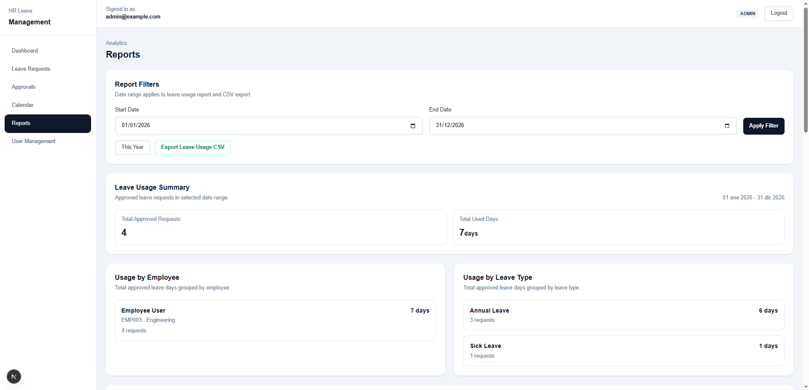
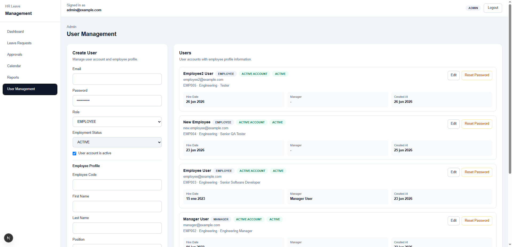

# HR Leave Management System

A full-stack HR Leave Management System built for portfolio demonstration.
The system supports employee leave requests, manager approval workflow, leave balances, calendar view, reports, and admin user management.

## Overview

This project is designed to demonstrate a real-world internal business application workflow.

Users can log in with different roles:

- ADMIN
- MANAGER
- EMPLOYEE

Each role has different permissions and views.

## Live Demo

Frontend Application:

https://hr-leave-management-system-livid.vercel.app

Backend API:

https://hr-leave-management-system-production.up.railway.app/api

Health Check:

https://hr-leave-management-system-production.up.railway.app/api/health

## Project Highlights

- Full-stack TypeScript application
- Real-world HR leave workflow
- JWT authentication
- Role-based access control
- Manager approval workflow
- Leave balance deduction after approval
- Admin user management
- CSV export report
- Mobile-friendly sidebar layout
- PostgreSQL database with Prisma ORM

## Portfolio Summary

HR Leave Management System is a full-stack web application designed to manage employee leave requests in an organization.

The application includes authentication, role-based access control, employee profiles, leave balances, leave request CRUD, manager approval workflow, calendar view, reports, CSV export, and admin user management.

This project demonstrates the ability to build a real-world business workflow using a modern full-stack TypeScript stack, including NestJS, Next.js, Prisma, PostgreSQL, JWT authentication, and protected frontend routes.

## Tech Stack

### Backend

- NestJS
- TypeScript
- Prisma ORM
- PostgreSQL / Supabase
- JWT Authentication
- Role-Based Access Control
- bcrypt password hashing

### Frontend

- Next.js
- TypeScript
- Tailwind CSS
- Fetch API
- Client-side auth storage
- Protected routes by role

### Database

- PostgreSQL
- Supabase hosted database

## Main Features

### Authentication

- Login with email and password
- JWT access token
- Role-based route protection
- Inactive users cannot log in

### Role-Based Access Control

ADMIN can:

- View all employees
- View all leave requests
- Manage leave types
- Manage leave balances
- Approve/reject leave requests
- View reports
- Manage users
- Reset user passwords

MANAGER can:

- View own profile and team members
- View own and team leave requests
- Approve/reject team leave requests
- View reports for self and team
- View calendar events for self and team

EMPLOYEE can:

- View own profile
- View own leave balances
- Create leave requests
- Edit pending leave requests
- Cancel pending leave requests
- View own approved leave calendar

## Core Modules

- Authentication
- Employees
- Leave Types
- Leave Balances
- Leave Requests
- Approvals
- Dashboard
- Calendar
- Reports
- Admin User Management

## Project Structure

hr-leave-management-system/

- backend/ - NestJS API
- frontend/ - Next.js frontend
- README.md - Main project documentation

## Backend API Summary

### Health

- GET /api/health
- GET /api/health/database

### Auth

- POST /api/auth/login
- GET /api/auth/me

### Employees

- GET /api/employees
- GET /api/employees/me
- GET /api/employees/:id
- PATCH /api/employees/:id

### Leave Types

- GET /api/leave-types
- GET /api/leave-types/:id
- POST /api/leave-types
- PATCH /api/leave-types/:id
- DELETE /api/leave-types/:id

### Leave Balances

- GET /api/leave-balances/me
- GET /api/leave-balances
- GET /api/leave-balances/:id
- PATCH /api/leave-balances/:id

### Leave Requests

- GET /api/leave-requests
- POST /api/leave-requests
- GET /api/leave-requests/:id
- PATCH /api/leave-requests/:id
- PATCH /api/leave-requests/:id/cancel

### Approvals

- GET /api/approvals/pending
- PATCH /api/approvals/:id/approve
- PATCH /api/approvals/:id/reject

### Dashboard

- GET /api/dashboard

### Calendar

- GET /api/calendar/leave-events

### Reports

- GET /api/reports/leave-usage
- GET /api/reports/leave-balances
- GET /api/reports/leave-usage/export

### Admin

- GET /api/admin/users
- GET /api/admin/users/:id
- POST /api/admin/users
- PATCH /api/admin/users/:id
- PATCH /api/admin/users/:id/reset-password

## Demo Accounts

Manager:

[manager@example.com](mailto:manager@example.com) / password123

Employee:

[employee@example.com](mailto:employee@example.com) / password123

Admin account is available upon request because it can modify demo data.

## Local Development Setup

### 1. Clone repository

git clone YOUR_REPOSITORY_URL
cd hr-leave-management-system

### 2. Backend setup

cd backend
npm install

Create `.env` from `.env.example`.

Required backend environment variables:

- PORT
- FRONTEND_URL
- DATABASE_URL
- JWT_SECRET
- JWT_EXPIRES_IN

Run database migration:

npx prisma migrate dev

Generate Prisma client:

npx prisma generate

Seed demo data:

npm run seed

Start backend:

npm run start:dev

Backend runs on:

http://localhost:4000/api

### 3. Frontend setup

cd frontend
npm install

Create `.env.local` from `.env.local.example`.

Required frontend environment variable:

NEXT_PUBLIC_API_URL=http://localhost:4000/api

Start frontend:

npm run dev

Frontend runs on:

http://localhost:3000

## Environment Files

Do not commit real environment files.

Ignored files:

- backend/.env
- frontend/.env.local

Safe example files:

- backend/.env.example
- frontend/.env.local.example

## Screenshots

### Login

### Dashboard

### Leave Requests

### Approvals

### Calendar

### Reports

### Admin User Management

## Deployment Notes

Recommended deployment setup:

- Frontend: Vercel
- Backend: Railway / Render
- Database: Supabase PostgreSQL

Required production environment variables:

Backend:

- PORT
- FRONTEND_URL
- DATABASE_URL
- JWT_SECRET
- JWT_EXPIRES_IN

Frontend:

- NEXT_PUBLIC_API_URL

## Security Notes

- Passwords are hashed using bcrypt.
- JWT secret is stored in environment variables.
- Database credentials are stored in environment variables.
- Role permissions are enforced on the backend.
- Frontend route protection is added for better user experience, but backend authorization remains the main security layer.

## Current Status

Implemented:

- Backend API
- Database schema
- Seed demo data
- Authentication
- Role-based access control
- Leave request workflow
- Approval workflow
- Dashboard
- Calendar
- Reports
- Admin user management
- Frontend protected layout
- Mobile sidebar
- Route protection by role

Planned improvements:

- Better dashboard charts
- Full calendar grid view
- Toast notifications
- Pagination and search
- Production deployment
- Screenshots in README
